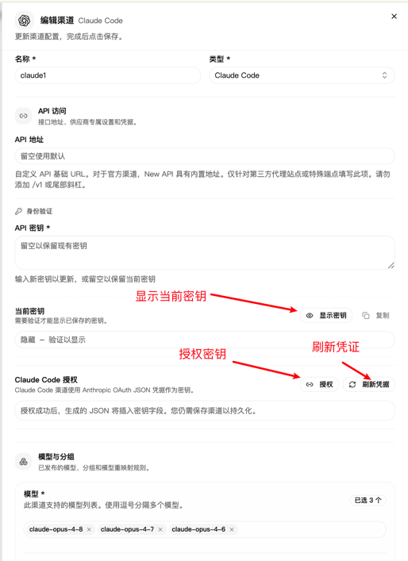
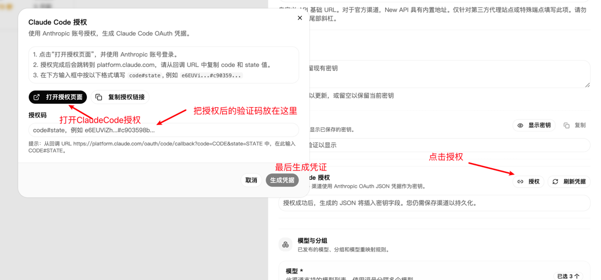
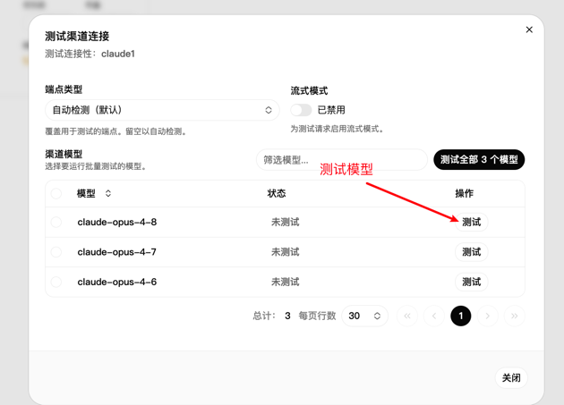
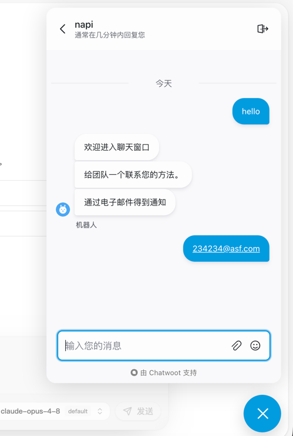

# Claude Code 渠道配置指南

## 概述

Claude Code 是 Anthropic 提供的官方命令行工具，支持通过 OAuth 方式授权访问 Claude API。New API 支持将 Claude Code 作为一个独立的渠道类型（Type 200），可以复用用户的 Claude Code CLI 凭据。

## 功能特性

- **OAuth 认证**：使用 Anthropic OAuth 2.0 流程授权
- **自动刷新**：支持自动刷新过期的 access token
- **凭据格式兼容**：支持 Claude Code CLI 原生格式和内部格式
- **Web 授权界面**：提供图形化授权流程，无需手动复制粘贴 token

## 渠道配置

### 1. 创建 Claude Code 渠道

1. 进入管理后台 → 渠道管理 → 添加渠道
2. 选择渠道类型：**Claude Code**
3. 填写渠道名称（如：`Claude Code - Personal`）
4. 配置密钥（两种方式）




### 2. 凭据配置方式

#### 方式一：Web 授权（推荐）

1. 点击"授权"按钮
2. 在弹出窗口中登录 Anthropic 账号
3. 同意授权 Claude Code 访问
4. 授权成功后凭据会自动填充



#### 方式二：手动粘贴凭据

如果您已经有 Claude Code CLI 的凭据，可以直接粘贴 JSON 格式的凭据。

**Claude Code CLI 格式**（`~/.claude/config.json`）：

```json
{
  "claudeAiOauth": {
    "accessToken": "sk-ant-oat01-...",
    "refreshToken": "sk-ant-ort01-...",
    "expiresAt": 1782662007674,
    "scopes": ["user:file_upload", "user:inference", "user:mcp_servers", "user:profile", "user:sessions:claude_code"],
    "subscriptionType": "pro",
    "rateLimitTier": "default_claude_ai"
  }
}
```

### 3. 模型配置

Claude Code 渠道支持的模型取决于您的 Anthropic 账号订阅类型：
常见模型如下：
- claude-fable-5
- claude-mythos-5
- claude-sonnet-5
- claude-sonnet-4.6
- claude-sonnet-4.5
- claude-sonnet-4
- claude-sonnet-3.7
- claude-opus-4.8
- claude-opus-4.7
- claude-opus-4.6
- claude-opus-4.5
- claude-haiku-4.5

### 4. 凭据管理

### 自动刷新机制

New API 会在以下情况自动刷新 Claude Code 凭据：

1. **请求前检查**：每次 API 请求前检查 token 是否过期（提前 5 分钟）
2. **定时任务**：系统定时扫描所有 Claude Code 渠道，刷新即将过期的凭据
3. **失败重试**：如果请求返回 401 Unauthorized，自动尝试刷新后重试

### 手动刷新

在渠道列表页，Claude Code 渠道会显示"刷新凭据"按钮，可以手动触发刷新。

### 凭据查看

超级管理员可以在渠道编辑页查看完整的凭据信息（包括 refresh token）。


### 5. 测试模型




### 6. 即时聊天

配置完成后，可以直接在 New API 内置的聊天界面中使用 Claude Code 渠道进行对话，无需借助第三方客户端。




## 常见问题

### Q: 凭据过期怎么办？

A: New API 会自动刷新凭据。如果自动刷新失败，可以：
1. 点击"刷新凭据"按钮手动刷新
2. 重新授权（点击"授权"按钮）

### Q: 支持哪些订阅类型？

A: 支持 Anthropic 的所有订阅类型：
- Free（免费版）
- Pro（专业版）
- Team（团队版，通过 Pro 凭据访问）

可用模型取决于您的订阅类型。

### Q: 如何获取 Claude Code CLI 凭据？

A: 安装并登录 Claude Code CLI：

```bash
# macOS
brew install claude

# 登录
claude auth login
```

登录后凭据会保存在 `~/.claude/config.json`。 如果是MacOS则在 MacOS的 “钥匙串” 里
 
### Q: 如何防止 Claude Code 封锁？
1. 如果只有一个账号：则只需要在服务器上使用，禁止其他ip使用相同凭据；
2. 如果多个账号：找个纯净的isp服务器作为代理，且每个账号的凭据获取只能在纯净isp服务器上获取；

## 技术细节

### OAuth 授权流程

1. 用户点击"授权"按钮
2. 前端打开 OAuth 授权窗口
3. 用户在 Anthropic 登录并授权
4. Anthropic 回调到 New API 后端 `/api/oauth/claude-code/callback`
5. 后端用 authorization code 换取 access token 和 refresh token
6. 前端接收到完整凭据并填充到表单

### Token 刷新流程

1. 检测到 token 过期或即将过期
2. 使用 refresh token 调用 Anthropic OAuth `/oauth/token` 端点
3. 获取新的 access token 和 refresh token
4. 更新数据库中的渠道密钥
5. 使用新 token 重试原始请求

### 凭据存储格式

数据库中的 `key` 字段存储 JSON 格式：

```json
{
  "access_token": "sk-ant-oat01-...",
  "refresh_token": "sk-ant-ort01-...",
  "expires_at": 1782662007674
}
```

前端提交的 `claudeAiOauth` 包装格式会在后端自动解包和规范化。

## 相关接口

### OAuth 授权入口

```
GET /api/oauth/claude-code/login
```

返回 Anthropic OAuth 授权 URL。

### OAuth 回调

```
GET /api/oauth/claude-code/callback?code=xxx&state=xxx
```

接收 Anthropic OAuth 回调，换取 token。

### 手动刷新凭据

```
POST /api/channel/:id/refresh-credential
```

触发单个渠道的凭据刷新。


